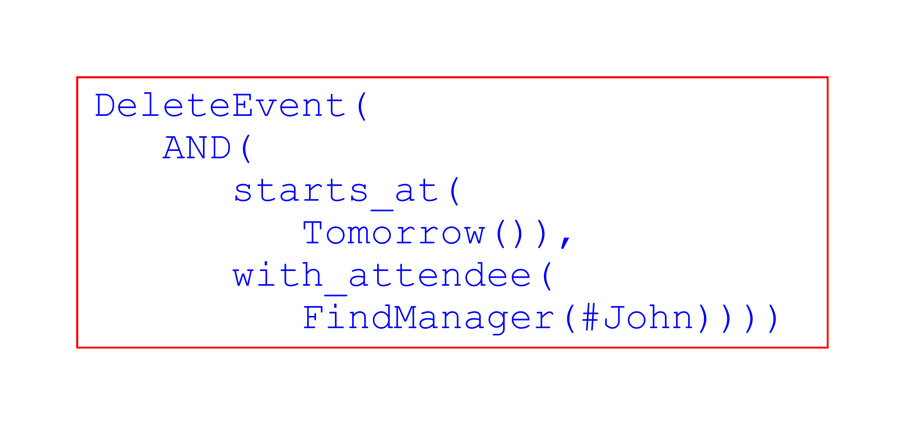
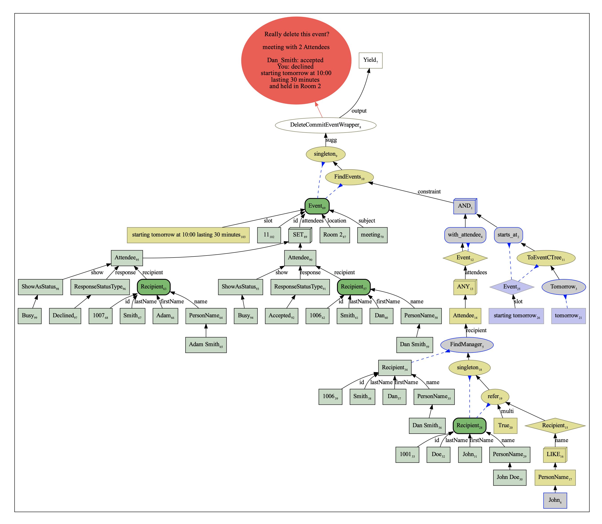

# OpenDF 
### Open Pythonic Dataflow Dialoguw Framework

The use of the dataflow paradigm for dialogue systems has been introduced by Microsoft's Semantic Machines in the paper
[Task oriented dialogue as dataflow synthesis](https://arxiv.org/abs/2009.11423), and a large dataset
(SMCalFlow) of dataflow-annotated dialogues has been released in their
[GitHub page](https://github.com/microsoft/task_oriented_dialogue_as_dataflow_synthesis).

This novel approach looks very promising, but unfortunately has not received much attention to date, as seen by the lack
of follow-up publications and use.

This may be due to the fact that the code to run the dataflow expressions, as well as detailed documentation of the
system, have not been released. Furthermore, SMCalFlow (which is, to date, the only dataset of dataflow annotations) is
quite difficult to understand without documentation.

This package aims to address these difficulties by including:

1. The basic infrastructure to construct, evaluate (execute), and inspect dataflow expressions;
2. Code to transform the SMCalFlow dataset to a simplified format;
3. Partial implementation of these simplified SMCalFlow functions.

This is intended to demonstrate that the dataflow dialogue paradigm is not inherently complicated
(although specific application can be).

This implementation is incomplete, and most likely is very different from Semantic Machines' original implementation,
but we hope that this package will ease the entry of more researchers and practitioners into this field, and that will
stimulate new ideas and new systems using this paradigm.

Dataflow dialogues are not monolithic - there isn't just one correct implementation and way of use. Rather, there are
many possible interpretations and flavours which can be implemented. Especially when it comes to applications, the
implementation of node functions, and the way nodes interact with each other can be very different.

Finding good designs can be a challenge (it is basically a software engineering problem), but once good designs have
been found, they can be used as templates, which can be reused for other applications.

Please give it a try and share your new designs!

See [this document](./README.dataflow.md) for some details about the dataflow dialogue framework,
and [this document](opendf/applications/smcalflow/README.md) about the SMCalFlow implementation.

## Installation

The system mainly depends on the libraries listed in the requirements.txt file. These dependencies can be installed in
your environment by running:

```
pip install -r requirements.txt
```

## Running

In order to execute a dataflow expression, simply run:

```
PYTHONPATH=$(pwd) python opendf/main.py
```

Or

```
PYTHONPATH=$(pwd) python opendf/main.py [-d index] [config params]
```

It will run the system with the example from `opendf/examples/main_examples.py`, defined by the `index`. In order to try new
examples, simply enter them in the examples file.

`dialog.py`, `dialog_simplify.py` and `dialog_text.py` are other entry points of the system, each of which having its
own example file, which are: `opendf/examples/examples.py`, `opendf/examples/simplify_examples.py` and
`opendf/examples/text_examples.py`, respectively.

You can define your own Nodes in the playground file: `opendf/applications/sandbox/sandbox.py`


### Example

In order to run dataflow, we need a P-expression (or simply, P-exp) that defines the dataflow graph. The advantage of
using P-exp is that we can use machine learning models to learn a mapping between natural language expression and P-exp.

As an example, the sentence:

```
Delete the meeting with John's supervisor tomorrow.
```

Can be translated to:

```
DeleteEvent(AND(starts_at(Tomorrow()), with_attendee(FindManager(John))))
```

Which can be better seen as:



As one can see, the P-exp is similar to the call of a function in a modern programing language. In this case,
`DeleteEvent`, `AND`, `starts_at`, `Tomorrow`, `with_attendee` and `FindManager` are the name of nodes that correspond
to python classes in the project. While the implementation of each node is given by its corresponding class. John, on
the other hand, is a final value (in this case, a string) (optionally, a "#" can be used to explicitly indicate terminal
values, but they are not required).

Each node receives a, possibly empty, list of arguments as inputs, that are also nodes. These arguments can be
positional, named or a mix of both. The type of arguments expected by each node is called the signature of the node, and
it is defined in its corresponding class.

The example above can be run using one of the commands below (assuming the user is in the root directory of the
project):

```
PYTHONPATH=$(pwd) python opendf/main.py -d 1
```

or

```
PYTHONPATH=$(pwd) python opendf/main.py -e "DeleteEvent(AND(starts_at(Tomorrow()), with_attendee(FindManager(John))))"
```


And the result should look like the image below:



The image might be slight different, depending on the type of nodes that are configured to show, hide or summarize.

## Cite


If you use this work, please cite the (upcoming) paper "Simplifying Semantic Annotations of SMCalFlow" to appear in LREC 2020
